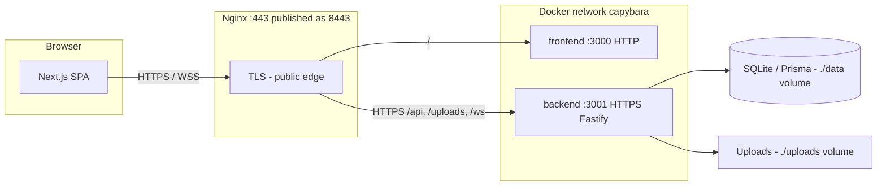

*This project has been created as part of the 42 curriculum by qtay, nchok, hheng, xquah*

# ft_transcendence 

## Description

**ft_transcendence** is a full-stack multiplayer Pong web application built as the final project of the 42 school common core. The goal is to deliver a complete, production-grade web platform where players can:

- Register and authenticate securely (including OAuth and 2FA)
- Play real-time Pong matches — locally, remotely, or against an AI opponent
- Compete in bracket-based tournaments
- Chat with friends in real time
- Track stats, match history, achievements, and progression on a personal dashboard
- View a global leaderboard and analytics

The application is served as a single-page app over HTTPS via Nginx, with a Fastify backend and a Next.js frontend, all orchestrated through Docker Compose.

---

## Team Information

| Login | Role |
|-------|------|
| Qiter | Project Manager, Developer |
| Nelson | Product Owner, Developer |
| Winnie | System Architect, Developer |
| Xuan | Tech Lead, Developer |

---

## Project Management

- **Communication:** Discord — daily communication, document sharing, and weekly sync meetings
- **Task Tracking:** Lark Docs — used to log issues, assign tasks, and track weekly progress
- **Version Control:** Git/GitHub — branching strategy with feature branches and pull requests for code review

---

## Technical Stack

### Frontend
- **Next.js 16** (App Router, Turbopack) + **React 19** + **TypeScript**
- **Tailwind CSS** + **shadcn/ui** for component library
- **Axios** for HTTP requests
- **jsPDF** for PDF export

### Backend
- **Fastify 5** — high-performance Node.js web framework
- **Prisma ORM** — type-safe database access
- **SQLite** — chosen for simplicity, zero-config setup, and ease of deployment in a containerized environment
- **WebSockets** (`@fastify/websocket`) — real-time game and chat communication

### Authentication
- **JWT** (access + refresh tokens)
- **Google OAuth 2.0** via `@fastify/oauth2`
- **TOTP-based 2FA** with backup codes

### Infrastructure
- **Docker Compose** — three services: `nginx`, `frontend`, `backend`
- **Nginx** — TLS termination, reverse proxy (port 8443 → internal services)
- All inter-service communication on a private Docker bridge network (`capybara`)

### Technical Choices
- **SQLite over PostgreSQL:** Eliminates the need for a separate database container, simplifying deployment with no loss of functionality for this scale.
- **Prisma ORM:** Provides type safety, migration support, and an auto-generated client, reducing boilerplate and bugs.
- **Next.js App Router:** Enables server components, layouts, and file-based routing — reducing client bundle size and simplifying route protection.
- **Fastify over Express:** Faster, schema-based validation, plugin architecture, and first-class WebSocket support.

---

## Architecture

The app runs as three Docker services on a private bridge network (`capybara`). Only **Nginx** is exposed on the host (`8443` → container `443`). The browser always uses **HTTPS/WSS** to Nginx; API, uploads, and WebSocket traffic is proxied to **Fastify over HTTPS** on the internal network. The Next.js frontend is reached over plain HTTP inside the network (TLS ends at Nginx for `/`).

| Hop | Protocol | TLS certificate |
|-----|----------|-----------------|
| Browser → Nginx | HTTPS / WSS | `nginx` image (`qtay.crt` / `qtay.key`) |
| Nginx → frontend | HTTP | — |
| Nginx → backend | HTTPS | `backend` image (`certs/server.crt`, CN=`backend`) |
| Fastify listener | HTTPS on `:3001` | Same backend certs (`app.js` → `getTlsOptions()`) |

Self-signed certificates are generated at **image build** in `nginx/Dockerfile` and `backend/Dockerfile`. Nginx uses `proxy_ssl_verify off` when connecting to the backend so the dev self-signed cert is accepted.



---

## Database Schema

### Models and Relationships

```
User ──────────── Profile (1:1)
Profile ──────── Match (as player1 or player2, many:many)
Profile ──────── Friendship (requester / addressee, many:many)
Profile ──────── Message (sender / recipient, many:many)
Profile ──────── Tournament (participants, many:many)
Profile ──────── Achievement (1:many)
Profile ──────── Block (blocker / blocked, many:many)
Match ─────────── Tournament (many:1, optional)
```

### Key Tables

| Table | Key Fields |
|-------|-----------|
| `User` | id, password (hashed), twoFA, twoFASecret, twoFABackup, resetOTP |
| `Profile` | id, email, username, avatar, totalXP, level, totalWins, totalLosses, totalDraws |
| `Match` | id, player1Id, player2Id, score1, score2, mode (LOCAL/REMOTE/AI/TOURNAMENT), durationSeconds, tournamentId |
| `Friendship` | id, requesterId, addresseeId, status (PENDING/ACCEPTED/DECLINED) |
| `Message` | id, senderId, recipientId, content, read, readAt |
| `Tournament` | id, date, winnerId, players[], matches[] |
| `Achievement` | id, profileId, achievementKey, unlockedAt |
| `Block` | id, blockerId, blockedId |

---

## Instructions

### Prerequisites

- [Docker](https://docs.docker.com/get-docker/) and Docker Compose (v2+)
- A valid SSL certificate (or use the self-signed cert generation script in `nginx/`)
- A Google OAuth 2.0 client (for OAuth login) — obtain at [console.cloud.google.com](https://console.cloud.google.com)

### Gmail App Password Setup (Pre-requisite)

The app sends emails for **2FA OTP codes and password resets** using a Gmail account. To allow this, you need a Google App Password (not your real Gmail password).

1. Go to [myaccount.google.com/apppasswords](https://myaccount.google.com/apppasswords) *(2-Step Verification must be enabled on the account first)*
2. Under **App name**, enter anything (e.g. `ft_transcendence`) and click **Create**.
3. Copy the auto-generated 16-character code.
4. Paste it into your `.env`:
   ```env
   EMAIL_USER=your-gmail@gmail.com
   EMAIL_PASSWORD=xxxx xxxx xxxx xxxx
   ```

> **Note:** You can only view this code once — save it immediately.

---

### Google OAuth Setup (Pre-requisite)

To enable Google Sign-In, you need to register the app in [Google Cloud Console](https://console.cloud.google.com/).

1. Create a new project (e.g., `ft-transcendence-dev`).
2. Navigate to **APIs & Services → OAuth consent screen**:
   - Select **External**.
   - Fill in the required App Information (Name, User Support Email).
   - Add your email under **Test Users**.
3. Navigate to **Credentials → Create Credentials → OAuth client ID**:
   - **Application type**: Web application
   - **Authorized JavaScript origins**: `https://localhost:8443`
   - **Authorized redirect URIs**: `https://localhost:8443/api/auth/google/callback`
4. Copy the **Client ID** and **Client Secret** and paste them into `backend/.env`:
   ```env
   GOOGLE_CLIENT_ID="xxxxxx.apps.googleusercontent.com"
   GOOGLE_CLIENT_SECRET="XXXXXXX"
   ```

> **Important:** You can only view the Client Secret once — save it immediately.  
> **Never commit these credentials to the repository.**

---

### Environment Setup

1. Clone the repository:
   ```bash
   git clone <repo-url> && cd ft_transcendence
   ```

2. Create the backend environment file:
   ```bash
   cp backend/.env.example backend/.env
   ```
   Edit `backend/.env` and fill in:
   ```env
   JWT_SECRET=<your-secret>
   TEMP_JWT_SECRET=<your-temp-secret>
   SECURITY_PEPPER=<your-pepper>
   SALT_ROUNDS=12
   GOOGLE_CLIENT_ID=<your-google-client-id>
   GOOGLE_CLIENT_SECRET=<your-google-client-secret>
   EMAIL_USER=<your-email>
   EMAIL_PASS=<your-email-app-password>
   ```

3. Build and run:
   ```bash
   make # build + start in detached mode
   ```
   Or for development with hot-reload:
   ```bash
   make dev
   ```

4. Open `https://localhost:8443` in your browser.
> Accept the self-signed certificate warning on first visit.

### Makefile Commands

| Command | Description |
|---------|-------------|
| `make` | Build and start all containers |
| `make dev` | Build and start with hot-reload (watch mode) |
| `make stop` | Stop containers |
| `make down` | Stop and remove containers |
| `make logs` | Follow container logs |
| `make clean` | Remove all Docker resources |
| `make re` | Clean and rebuild everything |
| `make lan-url` | Print the shareable LAN URL and update `PUBLIC_APP_URL` in `backend/.env` |
| `make lan-expose` | Open host firewall / WSL portproxy so LAN devices can reach port 8443 |
| `make ngrok` | Start an ngrok HTTPS tunnel, auto-update `PUBLIC_APP_URL`, and restart the backend |
| `make ngrok-sync` | Re-sync the current ngrok URL without restarting ngrok (pass `GOOGLE_CONSOLE_URL=<url>`) |

---

## Features List

| Feature | Description | Team |
|---------|-------------|------|
| User Registration & Login | Email/password signup and login with JWT | Qiter |
| Google OAuth 2.0 | Sign in with Google | Nelson, Qiter |
| Two-Factor Authentication (2FA) | TOTP-based 2FA with backup codes | Qiter |
| Password Reset | Email OTP-based password reset flow | Winnie |
| User Profiles | View/edit profile info, upload avatar | Qiter, Winnie |
| Friends System | Send/accept/decline requests, online status | Qiter, Winnie |
| Real-time Chat | Direct messaging via WebSockets, read receipts, typing indicators | Winnie |
| Block Users | Block users from messaging | Winnie |
| Local Pong (1v1) | Two players on the same machine | Nelson |
| Remote Pong | Two players on different machines in real time (up to 8 players) | Nelson, Qiter |
| AI Opponent | Play Pong against a computer opponent (3 difficulty levels) | Xuan |
| Tournament System | Bracket-based local and remote tournaments | Nelson |
| Spectator Mode | Watch ongoing games in real time | Nelson |
| Match History | Full match history with scores, modes, dates | Xuan, Nelson, Qiter |
| Achievements & Progression | XP system, levels, achievement unlocks | Xuan |
| Analytics Dashboard | Interactive charts, filters, activity tracking, win/loss stats | Winnie |
| Data Export | Export match history to CSV and PDF | Winnie |
| Leaderboard | Global ranking across all players | Xuan, Winnie |
| Reconnection Logic | Graceful reconnection for dropped WebSocket connections | Nelson |
| Game Invitations via Chat | Invite friends to a Pong match from the chat interface | Qiter, Winnie |
| Internationalisation (i18n) | UI available in 3+ languages with a language switcher | Winnie |

---

## Modules

### Major Modules — 16 pts

| Module | Team | Why Chosen | Key Technical Challenges | Value Added | Why It Deserves 2 pts |
|--------|------|-----------|--------------------------|-------------|----------------------|
| **Framework — Next.js + Fastify** | All | Industry-standard replacements for the mandatory minimal stack; better suited to a real-time, multi-page SPA | Fastify plugin registration order (JWT/WS/rate-limit); Next.js App Router learning curve (RSC, nested layouts); TypeScript consistency across both layers via Prisma-generated client | Faster request handling, schema validation reduces bugs, simplified auth guards, first-class Docker support | Replacing both mandatory frameworks simultaneously — two ecosystems, two Docker build toolchains, correct interoperation through Nginx |
| **Real-time WebSockets** | Nelson, Qiter | Live Pong, chat, and tournaments require persistent bidirectional comms; only viable option for <100 ms delivery | Room-scoped broadcast without state leaks; JWT-bound WS upgrades; `safeSend` on mid-send socket close; reconnection and stale-room cleanup | Single layer powers all real-time features — game, chat, friend status, invitations | Covers lifecycle management, auth integration, room broadcasting, and reconnection recovery simultaneously |
| **User Interaction — Chat, Profiles, Friends** | Winnie | Social features turn the game into a community platform | WebSocket delivery + SQLite persistence; bidirectional Prisma models (no duplicate rows); online-status broadcast without DB polling; block filtering at query level | Players chat, view profiles, and manage friends without leaving the platform | Full social graph + real-time persistent chat integrated with WebSocket and auth layers is equivalent to a standalone social product |
| **Standard User Management & Auth** | Qiter, Winnie | Auth is the foundation every other feature depends on | JWT access + refresh flow with HTTP-only `SameSite`/`Secure` cookies; three auth paths (email/OAuth/TOTP) in one session model; Sharp avatar re-encoding; Nginx brute-force rate limiting | Verified identity for every action; multiple login options lower onboarding friction | Spans multiple providers, TOTP 2FA, email OTP reset, avatar management, and full security hardening |
| **Complete Web-Based Pong Game** | Nelson | Core deliverable — must ship a polished, complete game | Deterministic server-authoritative game loop; canvas interpolation at variable frame rates; full lifecycle (pause/resume/rematch/timer); atomic match persistence | Primary reason users visit; smooth controls and clear HUD drive retention | Complete game engine with authoritative state, client rendering, lifecycle, and DB persistence is the largest single component |
| **Remote Players — Multiplayer** | Nelson, Qiter | Local play limits to co-located users; remote play makes it genuinely competitive | Room-code matchmaking across network conditions; latency smoothing; disconnect recovery with grace window before forfeit; stale-room memory-leak cleanup | Unlocks competitive use cases — friends in other cities, ranked matches, distributed tournaments | Real-time network sync requires solving distributed-state consistency, resilience, and room lifecycle simultaneously |
| **Advanced Analytics Dashboard** | Winnie | Interactive charts make performance data actionable rather than just numbers | Multi-dimensional aggregation from SQLite; reactive chart updates on new matches; pixel-accurate PDF via `jsPDF`; CSV with filter state; client-side recompute | Win-rate trends, peak hours, head-to-head records; export for external analysis | Multiple chart types, real-time updates, two export formats, and flexible filters require significant FE engineering and backend data modelling |
| **AI Opponent** | Xuan | Solo practice without needing another user online | Ball-trajectory prediction algorithm; 3 tunable difficulty levels (easy/medium/hard); integration into server-authoritative engine without performance overhead | Extends platform to solo users; consistent practice environment regardless of active player count | Real-time game AI with human-like behaviour and multiple difficulty levels requires substantial algorithmic and systems work |

**Major subtotal: 16 pts**

---

### Minor Modules — 9 pts

| Module | Team | Why Chosen | Key Technical Challenges | Value Added |
|--------|------|-----------|--------------------------|-------------|
| **ORM — Prisma** | Qiter, Nelson | Type-safe DB access eliminates raw SQL injection risks; migrations version the schema | SQLite + Docker config; cross-platform binary engine (Mac/Linux); keeping generated client in sync across team | Reduced boilerplate, compile-time type errors, reviewable schema changes |
| **Game Statistics & Match History** | Xuan, Qiter, Nelson | Persistent records back leaderboard, profile stats, and analytics | Atomic writes to prevent corruption; `durationSeconds` tracking across modes; achievements unlock conditions and XP model | Players review every match, track improvement, and earn achievements |
| **Google OAuth 2.0** | Nelson, Qiter | One-click login reduces sign-up friction | OAuth callback + JWT session coordination; account linking for existing emails; OAuth + 2FA edge cases | Broader accessibility and faster onboarding |
| **Two-Factor Authentication (2FA)** | Qiter | Stolen password alone cannot compromise an account | Encrypted TOTP secrets at rest; time-window validation; single-use backup codes; consistent gate across password + OAuth paths | Protects match history, personal data, and social connections |
| **Advanced Chat Features** | Winnie | Block, invitations, notifications, and receipts elevate chat to a social tool | Block list at DB query level; game-invite notifications persisted as `Message` rows; read/unread state without polling | Manage contacts, challenge friends from chat, never lose conversation context |
| **Tournament System** | Nelson | Structured bracket competition keeps groups engaged beyond casual 1v1 | Bracket progression logic; live WebSocket state sync; player-ready timeout handling | Up to 8 players in an organised bracket with a persistent record |
| **Spectator Mode** | Nelson | Watching live matches adds social dimension to competitive play | Read-only game-state stream; no game-input capability for spectators; same smooth updates as active players | Real-time match viewing for audiences during tournaments |
| **Data Export — CSV & PDF** | Winnie | Players need machine-readable archives and shareable reports | Pixel-accurate PDF via `jsPDF`; CSV serialisation of complex objects; active filter state applied to export | Players own their data and can use it in spreadsheets or personal archives |
| **Multilingual i18n (3+ languages)** | Winnie | The 42 community is international; accessibility matters | Full string coverage across all pages; live language switcher without reload; translation parity as features are added | Platform accessible in players' preferred language |

**Minor subtotal: 9 pts**

**Total: 25 pts**

---

## Individual Contributions

### Qiter — Project Manager & Developer

- **Auth & Security:** Sign-up/sign-in with JWT HTTP-only cookies, TOTP 2FA (QR setup, backup codes), Google OAuth + 2FA fix, Nginx auth rate limiting, and security headers.
- **Profile & Uploads:** Profile/settings pages with validation, avatar upload with Sharp re-encoding, and Nginx + Docker volume wiring for file serving.
- **Game & Social:** WebSocket plugin layer (`safeSend`), game HTTP/WS routes (local/remote/tournament), friends system, and in-chat game invitations.
- **Infrastructure:** HTTPS on Fastify, Nginx TLS reverse proxy config, and cross-platform Prisma fixes (Mac engine, SSL migration).
- **Documentation:** Architecture diagram (Mermaid), TLS hop table, and README.

---

### Nelson — Product Owner & Developer

- **Pong Game Engine:** Server-authoritative game loop, canvas rendering, full lifecycle (pause/resume, rematch, timer), and atomic match persistence.
- **Remote Multiplayer:** Room-code matchmaking, latency smoothing, disconnect recovery, and stale-room cleanup.
- **Tournament System:** Bracket tournaments with round progression, player-ready flow, and live leaderboard updates.
- **Spectator Mode:** Read-only real-time game-state stream to spectators with HUD and live match cards.
- **Game UX:** Responsive canvas, controls tray, match overlays, and smoother rendering.
- **WebSocket Infrastructure (with Qiter):** Remote broadcast tuning, tournament fan-out, and matchmaking queue.
- **Google OAuth:** Implemented the `@fastify/oauth2` login path.
- **Tooling:** LAN/ngrok helper scripts, public URL switching, and Docker startup fixes.

---

### Winnie — System Architect & Developer

- **Chat, Profiles & Friends (Major):** Real-time messaging with persistence, profile views from chat, and friends management with online-status indicators.
- **Advanced Chat (Minor):** Block system (DB-level), game invitations from chat, in-chat notifications, and typing indicators.
- **i18n (Minor):** i18n context with live language switcher and 3+ full translations.
- **Analytics Dashboard (Major):** Interactive charts (line/bar/pie), real-time updates, CSV/PDF export, and date/mode filters.
- **Password Reset:** Email OTP flow with Gmail App Password delivery.
- **User Management (with Qiter):** Profile-update validation and avatar-upload pipeline on the frontend.

---

### Xuan — Tech Lead & Developer

- **AI Opponent (Major):** Ball-trajectory prediction AI with human-like playstyle and 3 difficulty levels (easy/medium/hard), integrated into the server-authoritative engine.
- **Game Statistics & Match History (Minor):** User stats (wins/losses/ranking), match history display, achievements system with XP/levelling, and global leaderboard.
- **General:** Technical architecture decisions and code review standards.

---

## Resources

### Documentation & References

| Topic | Resource |
|-------|----------|
| Next.js App Router | https://nextjs.org/docs/app |
| Fastify | https://fastify.dev/docs/latest/ |
| Prisma ORM | https://www.prisma.io/docs |
| Fastify WebSockets (`@fastify/websocket`) | https://github.com/fastify/fastify-websocket |
| Fastify OAuth2 (`@fastify/oauth2`) | https://github.com/fastify/fastify-oauth2 |
| WebSocket API (MDN) | https://developer.mozilla.org/en-US/docs/Web/API/WebSocket |
| JSON Web Tokens | https://jwt.io/introduction |
| TOTP / RFC 6238 | https://datatracker.ietf.org/doc/html/rfc6238 |
| Google OAuth 2.0 | https://developers.google.com/identity/protocols/oauth2 |
| Sharp image processing | https://sharp.pixelplumbing.com/ |
| jsPDF | https://artskydj.github.io/jsPDF/docs/ |
| Tailwind CSS | https://tailwindcss.com/docs |
| shadcn/ui | https://ui.shadcn.com/ |
| Docker Compose | https://docs.docker.com/compose/ |
| Nginx reverse proxy | https://nginx.org/en/docs/ |
| SQLite | https://www.sqlite.org/docs.html |
| Canvas API (MDN) | https://developer.mozilla.org/en-US/docs/Web/API/Canvas_API |
| OWASP Top 10 | https://owasp.org/www-project-top-ten/ |

### AI Usage

AI tools (GitHub Copilot / Claude) were used in this project for the following purposes:

- **Code generation assistance:** Generating boilerplate for Fastify plugin registration, Prisma schema definitions, and React component scaffolding.
- **Debugging:** Asking AI to explain error messages (e.g., Prisma migration conflicts, WebSocket close codes) and suggest fixes.
- **Documentation:** Drafting and refining this README — section structure, module justifications, and architectural descriptions were written with AI assistance and reviewed/edited by the team.
- **Code review:** Using AI chat to review security-sensitive sections (JWT handling, cookie flags, file upload validation) for obvious vulnerabilities before manual review.
- **Learning:** Team members used AI explanations to ramp up on unfamiliar APIs (e.g., `@fastify/oauth2` callback structure, TOTP RFC details).

All AI-generated code was reviewed, tested, and understood by the team member who integrated it. No AI output was committed without human verification.

