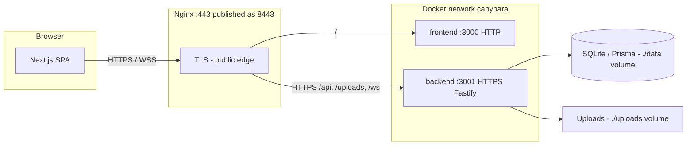

# ft_transcendence 

## Description

**ft_transcendence** is a full-stack multiplayer Pong web application built as the final project of the 42 school common core. The goal is to deliver a complete, production-grade web platform where players can:

- Register and authenticate securely (including OAuth and 2FA)
- Play real-time Pong matches — locally, remotely, or against an AI opponent
- Compete in bracket-based tournaments
- Chat with friends in real time
- Track stats, match history, achievements, and progression on a personal dashboard
- View a global leaderboard and analytics

The application is served as a single-page app over HTTPS via Nginx, with a Fastify backend and a Next.js frontend, all orchestrated through Docker Compose.

---

## Team Information

| Login | Role |
|-------|------|
| Qiter | Project Manager, Developer |
| Nelson | Product Owner, Developer |
| Winnie | System Architect, Developer |
| Xuan | Tech Lead, Developer |

---

## Project Management

- **Communication:** Discord — daily communication, document sharing, and weekly sync meetings
- **Task Tracking:** Lark Docs — used to log issues, assign tasks, and track weekly progress
- **Version Control:** Git/GitHub — branching strategy with feature branches and pull requests for code review

---

## Technical Stack

### Frontend
- **Next.js 16** (App Router, Turbopack) + **React 19** + **TypeScript**
- **Tailwind CSS** + **shadcn/ui** for component library
- **Axios** for HTTP requests
- **jsPDF** for PDF export

### Backend
- **Fastify 5** — high-performance Node.js web framework
- **Prisma ORM** — type-safe database access
- **SQLite** — chosen for simplicity, zero-config setup, and ease of deployment in a containerized environment
- **WebSockets** (`@fastify/websocket`) — real-time game and chat communication

### Authentication
- **JWT** (access + refresh tokens)
- **Google OAuth 2.0** via `@fastify/oauth2`
- **TOTP-based 2FA** with backup codes

### Infrastructure
- **Docker Compose** — three services: `nginx`, `frontend`, `backend`
- **Nginx** — TLS termination, reverse proxy (port 8443 → internal services)
- All inter-service communication on a private Docker bridge network (`capybara`)

### Technical Choices
- **SQLite over PostgreSQL:** Eliminates the need for a separate database container, simplifying deployment with no loss of functionality for this scale.
- **Prisma ORM:** Provides type safety, migration support, and an auto-generated client, reducing boilerplate and bugs.
- **Next.js App Router:** Enables server components, layouts, and file-based routing — reducing client bundle size and simplifying route protection.
- **Fastify over Express:** Faster, schema-based validation, plugin architecture, and first-class WebSocket support.

---

## Architecture

The app runs as three Docker services on a private bridge network (`capybara`). Only **Nginx** is exposed on the host (`8443` → container `443`). The browser always uses **HTTPS/WSS** to Nginx; API, uploads, and WebSocket traffic is proxied to **Fastify over HTTPS** on the internal network. The Next.js frontend is reached over plain HTTP inside the network (TLS ends at Nginx for `/`).

| Hop | Protocol | TLS certificate |
|-----|----------|-----------------|
| Browser → Nginx | HTTPS / WSS | `nginx` image (`qtay.crt` / `qtay.key`) |
| Nginx → frontend | HTTP | — |
| Nginx → backend | HTTPS | `backend` image (`certs/server.crt`, CN=`backend`) |
| Fastify listener | HTTPS on `:3001` | Same backend certs (`app.js` → `getTlsOptions()`) |

Self-signed certificates are generated at **image build** in `nginx/Dockerfile` and `backend/Dockerfile`. Nginx uses `proxy_ssl_verify off` when connecting to the backend so the dev self-signed cert is accepted.



---

## Database Schema

### Models and Relationships

```
User ──────────── Profile (1:1)
Profile ──────── Match (as player1 or player2, many:many)
Profile ──────── Friendship (requester / addressee, many:many)
Profile ──────── Message (sender / recipient, many:many)
Profile ──────── Tournament (participants, many:many)
Profile ──────── Achievement (1:many)
Profile ──────── Block (blocker / blocked, many:many)
Match ─────────── Tournament (many:1, optional)
```

### Key Tables

| Table | Key Fields |
|-------|-----------|
| `User` | id, password (hashed), twoFA, twoFASecret, twoFABackup, resetOTP |
| `Profile` | id, email, username, avatar, totalXP, level, totalWins, totalLosses, totalDraws |
| `Match` | id, player1Id, player2Id, score1, score2, mode (LOCAL/REMOTE/AI/TOURNAMENT), durationSeconds, tournamentId |
| `Friendship` | id, requesterId, addresseeId, status (PENDING/ACCEPTED/DECLINED) |
| `Message` | id, senderId, recipientId, content, read, readAt |
| `Tournament` | id, date, winnerId, players[], matches[] |
| `Achievement` | id, profileId, achievementKey, unlockedAt |
| `Block` | id, blockerId, blockedId |

---

## Instructions

### Prerequisites

- [Docker](https://docs.docker.com/get-docker/) and Docker Compose (v2+)
- A valid SSL certificate (or use the self-signed cert generation script in `nginx/`)
- A Google OAuth 2.0 client (for OAuth login) — obtain at [console.cloud.google.com](https://console.cloud.google.com)

### Gmail App Password Setup (Pre-requisite)

The app sends emails for **2FA OTP codes and password resets** using a Gmail account. To allow this, you need a Google App Password (not your real Gmail password).

1. Go to [myaccount.google.com/apppasswords](https://myaccount.google.com/apppasswords) *(2-Step Verification must be enabled on the account first)*
2. Under **App name**, enter anything (e.g. `ft_transcendence`) and click **Create**.
3. Copy the auto-generated 16-character code.
4. Paste it into your `.env`:
   ```env
   EMAIL_USER=your-gmail@gmail.com
   EMAIL_PASSWORD=xxxx xxxx xxxx xxxx
   ```

> **Note:** You can only view this code once — save it immediately.

---

### Google OAuth Setup (Pre-requisite)

To enable Google Sign-In, you need to register the app in [Google Cloud Console](https://console.cloud.google.com/).

1. Create a new project (e.g., `ft-transcendence-dev`).
2. Navigate to **APIs & Services → OAuth consent screen**:
   - Select **External**.
   - Fill in the required App Information (Name, User Support Email).
   - Add your email under **Test Users**.
3. Navigate to **Credentials → Create Credentials → OAuth client ID**:
   - **Application type**: Web application
   - **Authorized JavaScript origins**: `https://localhost:8443`
   - **Authorized redirect URIs**: `https://localhost:8443/api/auth/google/callback`
4. Copy the **Client ID** and **Client Secret** and paste them into `backend/.env`:
   ```env
   GOOGLE_CLIENT_ID="xxxxxx.apps.googleusercontent.com"
   GOOGLE_CLIENT_SECRET="XXXXXXX"
   ```

> **Important:** You can only view the Client Secret once — save it immediately.  
> **Never commit these credentials to the repository.**

---

### Environment Setup

1. Clone the repository:
   ```bash
   git clone <repo-url> && cd ft_transcendence
   ```

2. Create the backend environment file:
   ```bash
   cp backend/.env.example backend/.env
   ```
   Edit `backend/.env` and fill in:
   ```env
   JWT_SECRET=<your-secret>
   TEMP_JWT_SECRET=<your-temp-secret>
   SECURITY_PEPPER=<your-pepper>
   SALT_ROUNDS=12
   GOOGLE_CLIENT_ID=<your-google-client-id>
   GOOGLE_CLIENT_SECRET=<your-google-client-secret>
   EMAIL_USER=<your-email>
   EMAIL_PASS=<your-email-app-password>
   ```

3. Build and run:
   ```bash
   make # build + start in detached mode
   ```
   Or for development with hot-reload:
   ```bash
   make dev
   ```

4. Open `https://localhost:8443` in your browser.
> Accept the self-signed certificate warning on first visit.

### Makefile Commands

| Command | Description |
|---------|-------------|
| `make` | Build and start all containers |
| `make dev` | Build and start with hot-reload (watch mode) |
| `make stop` | Stop containers |
| `make down` | Stop and remove containers |
| `make logs` | Follow container logs |
| `make clean` | Remove all Docker resources |
| `make re` | Clean and rebuild everything |

---

## Features List

| Feature | Description |
|---------|-------------|
| User Registration & Login | Email/password signup and login with JWT |
| Google OAuth 2.0 | Sign in with Google |
| Two-Factor Authentication (2FA) | TOTP-based 2FA with backup codes |
| Password Reset | Email OTP-based password reset flow |
| User Profiles | View/edit profile info, upload avatar |
| Friends System | Send/accept/decline requests, online status |
| Real-time Chat | Direct messaging via WebSockets, read receipts, typing indicators |
| Block Users | Block users from messaging |
| Local Pong (1v1) | Two players on the same machine |
| Remote Pong | Two players on different machines in real time ( max 8 player) |
| AI Opponent | Play Pong against a computer opponent |
| Tournament System | Bracket-based local and remote tournaments |
| Spectator Mode | Watch ongoing games in real time |
| Match History | Full match history with scores, modes, dates |
| Achievements & Progression | XP system, levels, achievement unlocks |
| Analytics Dashboard | Charts, filters, activity tracking, win/loss stats |
| Data Export | Export match history to CSV and PDF |
| Leaderboard | Global ranking across all players |
| Reconnection Logic | Graceful reconnection for dropped WebSocket connections |

---

## Modules

### Major Modules (2 pts each)

| Module | Points |
|--------|--------|
| Framework for frontend and backend (Next.js + Fastify) | 2 |
| Real-time features using WebSockets | 2 |
| User interaction (chat, profiles, friends) | 2 |
| Standard user management and authentication | 2 |
| Complete web-based multiplayer game (Pong) | 2 |
| Remote players (real-time multiplayer over network) | 2 |
| Advanced analytics dashboard with data visualization | 2 |
| AI Opponent | 2 |

**Major subtotal: 16 pts**

### Minor Modules (1 pt each)

| Module | Points |
|--------|--------|
| ORM for database (Prisma) | 1 |
| Game statistics and match history | 1 |
| Remote authentication with OAuth 2.0 (Google) | 1 |
| Two-Factor Authentication (2FA) | 1 |
| User activity analytics and insights dashboard | 1 |
| Advanced chat features | 1 |
| Tournament system | 1 |
| Spectator mode | 1 |
| Data export and import functionality | 1 |
| README.md requirements | 1 |

**Minor subtotal: 10 pts**

**Total: 26 pts**

---

## Individual Contributions

### Qiter — Project Manager & Developer
- 

### Nelson — Product Owner & Developer
-

### Winnie — System Architect & Developer
- 

### Xuan — Tech Lead & Developer
-


