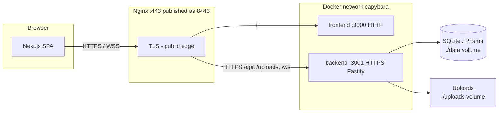

# ft_transcendence

A full-stack multiplayer Pong web application built as the final project of the 42 school common core. Players can register, play real-time Pong matches (local, remote, or vs AI), compete in tournaments, chat with friends, and manage their profiles — all served over HTTPS through a single-page application.

## Tech Stack

| Layer | Technology |
|-------|-----------|
| Frontend | Next.js 16, React 19, TypeScript, Tailwind CSS, shadcn/ui |
| Backend | Fastify 5, Prisma (SQLite), WebSockets |
| Auth | JWT, Google OAuth2, 2FA (TOTP) |
| Infra | Docker Compose, Nginx (HTTPS edge), Fastify (HTTPS) |

## Architecture

The app runs as three Docker services on a private bridge network (`capybara`). Only **Nginx** is exposed on the host (`8443` → container `443`). The browser always uses **HTTPS/WSS** to Nginx; API, uploads, and WebSocket traffic is proxied to **Fastify over HTTPS** on the internal network. The Next.js frontend is reached over plain HTTP inside the network (TLS ends at Nginx for `/`).

| Hop | Protocol | TLS certificate |
|-----|----------|-----------------|
| Browser → Nginx | HTTPS / WSS | `nginx` image (`qtay.crt` / `qtay.key`) |
| Nginx → frontend | HTTP | — |
| Nginx → backend | HTTPS | `backend` image (`certs/server.crt`, CN=`backend`) |
| Fastify listener | HTTPS on `:3001` | Same backend certs (`app.js` → `getTlsOptions()`) |

Self-signed certificates are generated at **image build** in `nginx/Dockerfile` and `backend/Dockerfile`. Nginx uses `proxy_ssl_verify off` when connecting to the backend so the dev self-signed cert is accepted.



**Backend TLS config:** `backend/app.js` exports `options` (`https`, `trustProxy`). fastify-cli must be started with **`-o`** so those options apply (`npm run start` / `npm run dev` in `backend/package.json`). Compose file watch ignores `backend/certs/` so dev sync does not remove certs baked into the image.

## Features

- **Pong Game** — real-time multiplayer with local, remote, and AI modes
- **Tournaments** — bracket-based tournament system
- **User Auth** — registration, login, Google OAuth, password reset via email, Two-Factor Authentication (TOTP + backup codes)
- **Profiles** — avatar upload, editable user info, match history
- **Friends** — send/accept/decline friend requests, online status
- **Chat** — real-time direct messaging via WebSockets
- **Responsive SPA** — single-page app with protected routes

## Getting Started

### Prerequisites

- [Docker](https://docs.docker.com/get-docker/) & Docker Compose

### Setup

1. Clone the repository:
   ```bash
   git clone <repo-url> && cd ft_transcendence
   ```

2. Create the backend environment file:
   ```bash
   cp backend/.env.example backend/.env
   # Fill in JWT_SECRET, TEMP_JWT_SECRET, Google OAuth credentials, and email credentials
   ```

3. Build and run:
   ```bash
   make        # build + start in detached mode
   ```
   Or for development with hot-reload:
   ```bash
   make dev
   ```

4. Open `https://localhost:8443` in your browser.

### Makefile Commands

| Command | Description |
|---------|-------------|
| `make` | Build and start all containers |
| `make dev` | Build and start with hot-reload (watch mode) |
| `make stop` | Stop containers |
| `make down` | Stop and remove containers |
| `make logs` | Follow container logs |
| `make clean` | Remove all Docker resources |
| `make re` | Clean and rebuild everything |