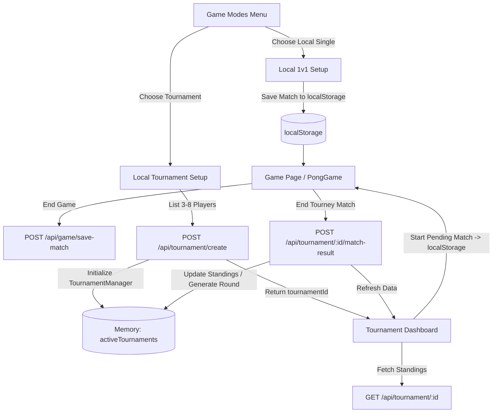

# Local Play (1v1 & Tournament) — Feature Explanation (Repo-Grounded)

## 0) Metadata
- Feature: Local Play (1v1 & Tournament)
- Date: 2026-02-28
- Scope: Explain-only
- Keywords searched: local play, 1v1, tournament, matchId

---

## 1) Feature Overview
### User flow
- Mode Selection: Navigate to `/game/new` and select "Local Play".
- Sub-mode Selection: Choose "Single Match" or "Tournament".
- Configuration:
  - Single Match: Input guest name. Match configuration saved to `localStorage`, navigates to `/game/[matchId]`.
  - Tournament: Add 2-7 guest players. Backend generates bracket. Routes to `/game/local/tournament/[tournamentId]`.
- Gameplay: Played locally via `<PongGame />`. W/S for P1, Arrow Up/Down for P2.
- Conclusion: Match result saved via backend. Tournament updates standings until concluded.

### Success states
- Matches begin correctly syncing input locally.
- Tournament standings dynamically adjust based on match outcomes.

### Error / empty states
- Adding fewer than 3 or more than 8 players disables "Begin Tournament" button.
- Invalid tournament ID shows "Tournament Not Found" fallback screen.

---

## 2) Repo Discovery Summary (Evidence Map)
> List real files discovered in the repo.

a) Routes/Pages
- `frontend/app/(protected)/game/new/page.tsx` — Mode selection
- `frontend/app/(protected)/game/local/single/page.tsx` — Local 1v1 setup
- `frontend/app/(protected)/game/local/tournament/page.tsx` — Tournament setup
- `frontend/app/(protected)/game/local/tournament/[tournamentId]/page.tsx` — Tournament dashboard
- `frontend/app/(protected)/game/[matchId]/page.tsx` — Active match rendering shell

b) UI Components
- `frontend/components/game/PongGame.tsx` — Core game rendering canvas
- `frontend/components/game/GameOverDialog.tsx` — End of match popup

c) State/Data (useState/Context/Redux/Zustand/TanStack Query/etc.)
- `localStorage ("current-match")` — Passes match initialization parameters (metadata/players)
- `frontend/hooks/usePongGame.ts` — Local game loop and physics state
- `frontend/hooks/use-game.tsx` — Game context

d) API Client Modules
- `axios` inside hooks/pages — Calling standard REST game endpoints.

e) Backend Routes/Controllers
- `backend/routes/api/tournament/index.js` — Tournament bracket creation, fetches, and match updates
- `backend/routes/api/game/index.js` — Saving local match results `/save-match`

f) Services / Business Logic
- `backend/game/TournamentManager.js` — In-memory bracket generation, standings calculation

g) Data Models / Schemas / Queries
- Uses Prisma to save match results inside `/api/game/save-match`.

---

## 3) File Index (Navigation Map)
- UI: `/game/new`, `/game/local/single`, `/game/local/tournament`, `/game/[matchId]`, `PongGame.tsx`
- State/Data: `localStorage`, `usePongGame.ts`, `use-game.tsx`
- API Client: axios embedded in components
- Backend Routes/Controllers: `api/tournament/index.js`, `api/game/index.js`
- Services: `TournamentManager.js`
- Data Layer: Prisma generic match records
- Side Effects/Async: N/A
- Security: Protected routes requiring JWT
- Observability: console logs
- Tests: N/A

---

## 4) End-to-End Call Chain Trace
Trace runtime path:
UI event → state update → API call → backend handler → service → DB → response → UI render

### Step 1: UI Entry (Single Match Setup)
- File: `frontend/app/(protected)/game/local/single/page.tsx`
- Function(s): `handleStartMatch`
- Inputs/Outputs: Bundles Auth User + Guest into JSON payload.
- Branches (loading/error/empty): If user config is valid.
- Notes: Saves to `localStorage("current-match")` and pushes router to `/game/<matchId>`.

### Step 2: Game Shell Init
- File: `frontend/app/(protected)/game/[matchId]/page.tsx`
- Function(s): useEffect initialization
- Inputs/Outputs: Unmarshals `localStorage`. Passes config to `<PongGame />`.

### Step 3: Local Game Loop
- File: `frontend/components/game/PongGame.tsx`
- Function(s): `usePongGame` loop
- Inputs/Outputs: W/S and Arrow coordinates change paddle position in real-time.

### Step 4: End Game & Save
- File: `frontend/app/(protected)/game/[matchId]/page.tsx`
- Function(s): `handleGameOver`
- Inputs/Outputs: Submits score payload to API.
- Endpoint: `POST /api/game/save-match`

### Step 5: Backend Save
- File: `backend/routes/api/game/index.js`
- Function(s): `/save-match` controller
- Inputs/Outputs: Persists match to Postgres via Prisma.

---

## 5) Function-by-Function Catalog
For each key function/class:

- Name: `handleStartMatch`
- File: `frontend/app/(protected)/game/local/single/page.tsx`
- Responsibilities: Wraps local player config payload, commits to `localStorage`, boots game route.

- Name: `handleStartTournament`
- File: `frontend/app/(protected)/game/local/tournament/page.tsx`
- Responsibilities: Validates player count (3-8), triggers bracket creation on backend.
- Calls: `POST /api/tournament/create`

- Name: `POST /create`
- File: `backend/routes/api/tournament/index.js`
- Responsibilities: Initializes TournamentManager and generates initial pairings. Stores memory ref.

- Name: `updateMatchResult`
- File: `backend/game/TournamentManager.js`
- Responsibilities: Flags match complete, calculates standings, computes next Swiss round if round finishes.

- Name: `handleGameOver`
- File: `frontend/app/(protected)/game/[matchId]/page.tsx`
- Responsibilities: Stops loop, shows GameOverDialog, executes Axios call to `/api/game/save-match`.

---

## 6) Call Graph Diagram

---

## 7) Architecture Notes (Fill fully ONLY if code changed)
N/A (no code changes)

---

## 8) Change Ledger (ONLY if code changed)
Explain-only: N/A (no code changes)
