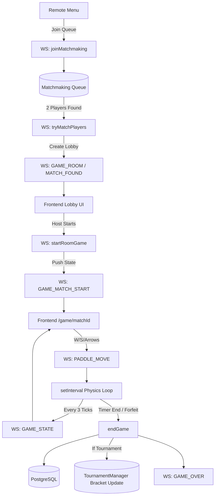

# Remote Play (1v1 & Tournament) — Feature Explanation (Repo-Grounded)

## 0) Metadata
- Feature: Remote Play (1v1 & Tournament)
- Date: 2026-02-28
- Scope: Explain-only
- Keywords searched: remote play, websocket, matchmaking, game loop

---

## 1) Feature Overview
### User flow
- Mode Selection: Navigate to `/game/new` -> "Remote Play" -> "Single Match" or "Tournament".
- Matchmaking: User waits in a queue. `MATCH_FOUND` or `TOURNAMENT_FOUND` emitted.
- Gameplay (Server-Authoritative): Client pushes `W/S/Arrow` via WebSockets. Fastify backend computes ball physics at 60FPS. Client receives `GAME_STATE` every 3 ticks (~20FPS) and renders exactly what server says.
- Conclusion: Match ends via timer or forfeit. Server saves DB state and broadcasts `GAME_OVER`.

### Success states
- Match is established and real-time state broadcasts seamlessly via WebSocket.
- Database records remote match accurately.
- Tournament brackets are advanced live.

### Error / empty states
- Grace Period: If WebSocket drops, pausing game for 30 seconds.
- Reconnection: Restores play on return.
- Forfeit/Abandon: Auto-loss if missing for 30s.

---

## 2) Repo Discovery Summary (Evidence Map)
> List real files discovered in the repo.

a) Routes/Pages
- `frontend/app/(protected)/game/remote/single/page.tsx` — 1v1 Hub
- `frontend/app/(protected)/game/remote/tournament/page.tsx` — Tourney Hub
- `frontend/app/(protected)/game/[matchId]/page.tsx` — Main shell

b) UI Components
- `frontend/components/game/PongGame.tsx` — Canvas drawer reading `externalGameState`.

c) State/Data (useState/Context/Redux/Zustand/TanStack Query/etc.)
- `frontend/context/socket-context.tsx` — Global WS listener and route dispatcher.
- `frontend/hooks/usePongGame.ts` — Keyboard listener mapping to WS input.

d) API Client Modules
- Real-time `WebSocket` wrapper replacing traditional JSON API loading.

e) Backend Routes/Controllers
- `backend/routes/ws/connect-ws.js` — WebSocket connection router endpoint.

f) Services / Business Logic
- `backend/plugins/ws-utils/ws-game.js` — Lobby matching queue management.
- `backend/plugins/ws-utils/ws-game-matches.js` — Physics mathematical engine, collisions, timeouts.

g) Data Models / Schemas / Queries
- `prisma.match.create` invoked natively inside `ws-game-matches.js` endgame logic.

---

## 3) File Index (Navigation Map)
- UI: `/remote/single`, `/remote/tournament`, `[matchId]/page.tsx`, `PongGame.tsx`
- State/Data: `socket-context.tsx`, `usePongGame.ts`
- API Client: WebSocket 
- Backend Routes/Controllers: `connect-ws.js`
- Services: `ws-game.js`, `ws-game-matches.js`
- Data Layer: PostgreSQL Prisma inside WS handler
- Side Effects/Async: 30-second disconnect timeout timers
- Security: Requires auth user profile socket connections

---

## 4) End-to-End Call Chain Trace
Trace runtime path:
UI event → state update → API call → backend handler → service → DB → response → UI render

### Step 1: UI Entry (Join Queue)
- File: Single/Matchmaking pages
- Function(s): Emit `JOIN_MATCHMAKING`
- Branches (loading/error/empty): Searches for single vs tournament modes.

### Step 2: Backend Match Found
- File: `backend/plugins/ws-utils/ws-game.js`
- Function(s): `tryMatchPlayers` 
- Notes: Evaluates open rooms and dispatches `MATCH_FOUND`.

### Step 3: Game Initialization
- File: `backend/plugins/ws-utils/ws-game-matches.js`
- Function(s): `startRoomGame`
- Notes: Sets up `fastify.gameStates` Map matrix, pushes `GAME_MATCH_START`.

### Step 4: Client Routing
- File: `frontend/context/socket-context.tsx`
- Function(s): WS Listener
- Inputs/Outputs: Hears `GAME_MATCH_START` and invokes `router.push("/game/<matchId>")`.

### Step 5: Physics Loop 
- File: `backend/plugins/ws-utils/ws-game-matches.js`
- Function(s): `startGameLoop`
- Notes: Server-side `setInterval` moving ball at 60fps.

### Step 6: End Game Save
- File: `backend/plugins/ws-utils/ws-game-matches.js`
- Function(s): `endGame`
- Inputs/Outputs: Calls `prisma.match.create`, deletes memory state, emits `GAME_OVER`.

---

## 5) Function-by-Function Catalog
For each key function/class:

- Name: `joinMatchmaking`
- File: `backend/plugins/ws-utils/ws-game.js`
- Responsibilities: Assigns websocket into queue structures depending on game mode.

- Name: `startRoomGame`
- File: `backend/plugins/ws-utils/ws-game-matches.js`
- Responsibilities: Prepares coordinates (0,0 center ball), initializes scores to 0-0.

- Name: `startGameLoop`
- File: `backend/plugins/ws-utils/ws-game-matches.js`
- Responsibilities: Mathematical bounding box detector and vector acceleration.

- Name: `broadcastState`
- File: `backend/plugins/ws-utils/ws-game-matches.js`
- Responsibilities: Throttled network emitter (every 3 ticks) broadcasting full map.

- Name: `endGame`
- File: `backend/plugins/ws-utils/ws-game-matches.js`
- Responsibilities: Stops the physics interval gracefully, flushes data to SQL, and issues complete notification.

- Name: `handlePlayerNavigatingAway`
- File: `backend/plugins/ws-utils/ws-game-matches.js`
- Responsibilities: Manages connection fragility. Initiates graceful 30-sec countdown before automatic loss assignment.

---

## 6) Call Graph Diagram

---

## 7) Architecture Notes (Fill fully ONLY if code changed)
N/A (no code changes)

---

## 8) Change Ledger (ONLY if code changed)
Explain-only: N/A (no code changes)
