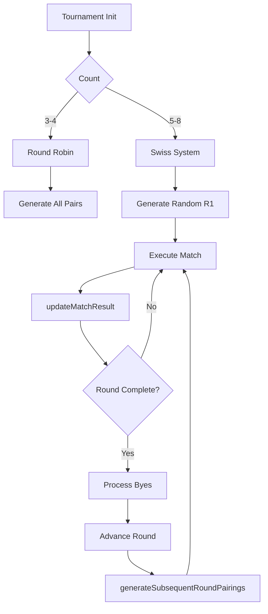

# Tournament Matching Logic — Feature Explanation (Repo-Grounded)

## 0) Metadata
- Feature: Tournament Matching Logic (Round Robin & Swiss)
- Date: 2026-02-28
- Scope: Explain-only
- Keywords searched: tournament, round robin, swiss, pairing, manager

---

## 1) Feature Overview
### User flow
- Tournaments generated via "Local Tournament" screen or 3-8 players joining the "Remote Matchmaking" queue.
- Backend constructs a Tournament Manager bracket engine mapping all users into structural arrays.
- 3-4 Players: Deploys Round Robin (everyone plays everyone once). All schedules defined at onset.
- 5-8 Players: Deploys Swiss System (3 fixed rounds). Dynamic pairings based on Points, Average Math differentials matching close skill groups per round.
- Results tabulated into a finalized Standings leaderboard.

### Success states
- Precise accurate mathematical pairing and proper byes assigned automatically.
- Resilient recovery handling player disconnect/forfeit giving walkover wins correctly without corrupting entire logical bracket.

### Error / empty states
- N/A

---

## 2) Repo Discovery Summary (Evidence Map)
> List real files discovered in the repo.

a) Routes/Pages
- Handled largely by generic tournament dashboards querying data arrays.

e) Backend Routes/Controllers
- `backend/routes/api/tournament/index.js` — Trigger to compute formats.

f) Services / Business Logic
- `backend/game/TournamentManager.js` — Core logical state engine matching and sorting player entities based on round results.

---

## 3) File Index (Navigation Map)
- Backend Routes/Controllers: `routes/api/tournament/index.js`
- Services: `TournamentManager.js`

---

## 4) End-to-End Call Chain Trace
Trace runtime path:
UI event → state update → API call → backend handler → service → DB → response → UI render

### Step 1: Initialization
- File: `backend/routes/api/tournament/index.js`
- Function(s): `POST /create` or generic tournament start handler.
- Notes: Instantiates `new TournamentManager(id, players)` returning bracket format via `determineFormat(playerCount)`.

### Step 2: Generation Sweep Request
- File: `backend/game/TournamentManager.js`
- Notes: Evaluates `generateRoundRobinPairings()` simultaneously mapping every single match recursively upfront for 3-4 players. Alternatively triggers `generateFirstRoundPairings()` pseudo-randomly for Swiss 5-8 players.

### Step 3: Match Resolution Input
- File: `backend/game/TournamentManager.js`
- Function(s): `updateMatchResult`
- Inputs/Outputs: Win provides 3 Points, Loss gives 0, Draw 1. Computes total point differential inside internal `standings` array list.

### Step 4: Swiss Dynamic Round Check
- File: `backend/game/TournamentManager.js`
- Function(s): `checkAndProcessRoundBye`
- Branches: Scrutinizes if `allRealMatchesComplete` === true. Automatically cascades by auto-completing pending "Bye" matches (3pts), transitioning `currentRound++`, and triggering `generateSubsequentRoundPairings` internally if Swiss format active.

---

## 5) Function-by-Function Catalog
For each key function/class:

- Name: `generateRoundRobinPairings`
- File: `backend/game/TournamentManager.js`
- Responsibilities: Uses standard 'Circle Method' algorithm. Appends `null` array index if player count odd to distribute Byes naturally. Matches index `i` vs `length-1-i` and splices rotations dynamically.

- Name: `generateSubsequentRoundPairings`
- File: `backend/game/TournamentManager.js`
- Responsibilities: Analyzes leaderboard using priority sorting [1. Match Points, 2. Score Differential, 3. Total Points]. Awards lowest-ranking unpaid player a Bye recursively. Uses greedy lookup validation `!sorted[i].opponents.includes()` mapping strictly unique pairing history logic, falling back gracefully to rematches if absolutely statistically necessary.

- Name: `resolveFutureMatchesForWithdrawn`
- File: `backend/game/TournamentManager.js`
- Responsibilities: Safely resolves structural breaks when a user disconnects entirely ensuring all associated sub-matches automatically receive a `walkover` 3pt outcome gracefully instead of erroring bracket tree bounds.

---

## 6) Call Graph Diagram

---

## 7) Architecture Notes (Fill fully ONLY if code changed)
N/A (no code changes)

---

## 8) Change Ledger (ONLY if code changed)
Explain-only: N/A (no code changes)
